# Домашнее задание к занятию "Что такое DevOps. СI/СD" - Бетко Алексей

### Задание 1

Что нужно сделать:

1. Установите себе jenkins по инструкции из лекции или любым другим способом из официальной документации. Использовать Docker в этом задании нежелательно.
2. Установите на машину с jenkins golang.
3. Используя свой аккаунт на GitHub, сделайте себе форк репозитория. В этом же репозитории находится дополнительный материал для выполнения ДЗ.
4. Создайте в jenkins Freestyle Project, подключите получившийся репозиторий к нему и произведите запуск тестов и сборку проекта go test . и docker build ..

В качестве ответа пришлите скриншоты с настройками проекта и результатами выполнения сборки.

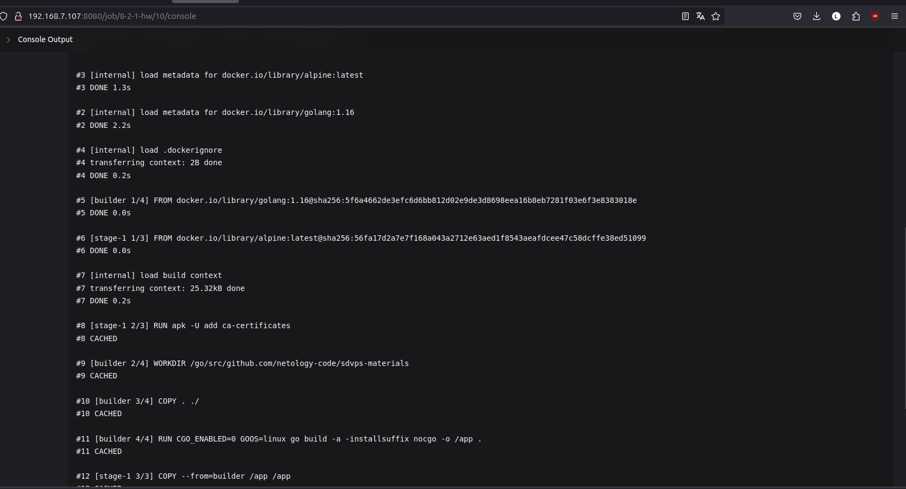
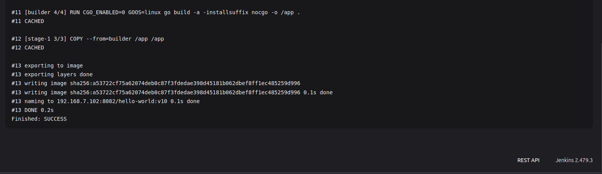

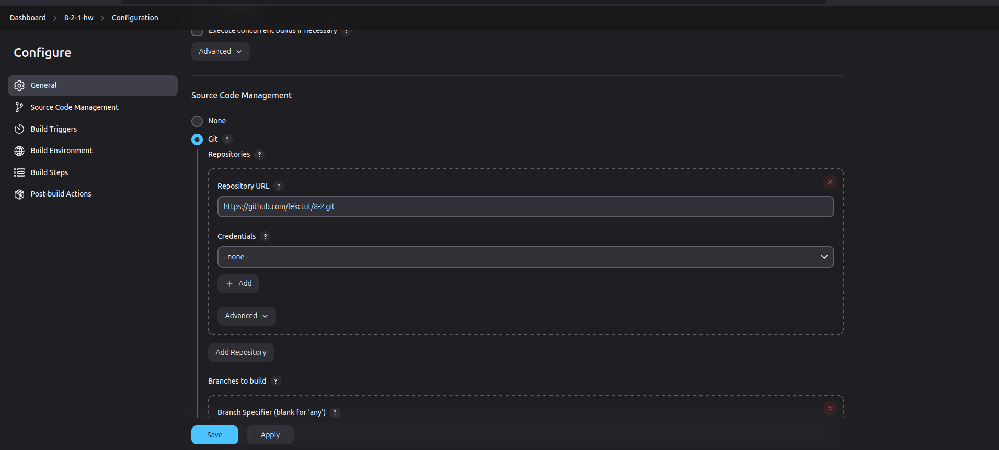
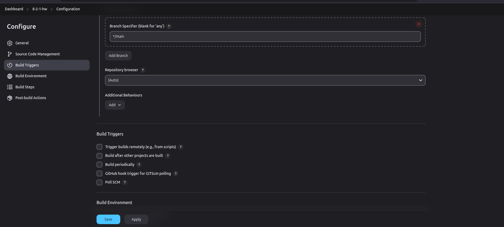
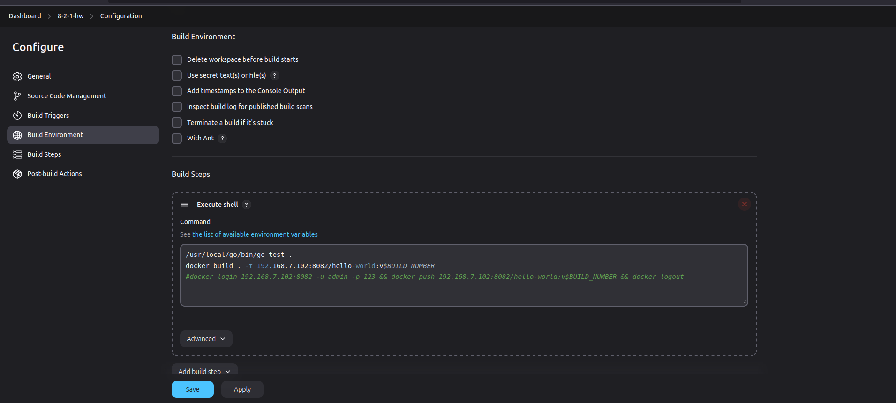
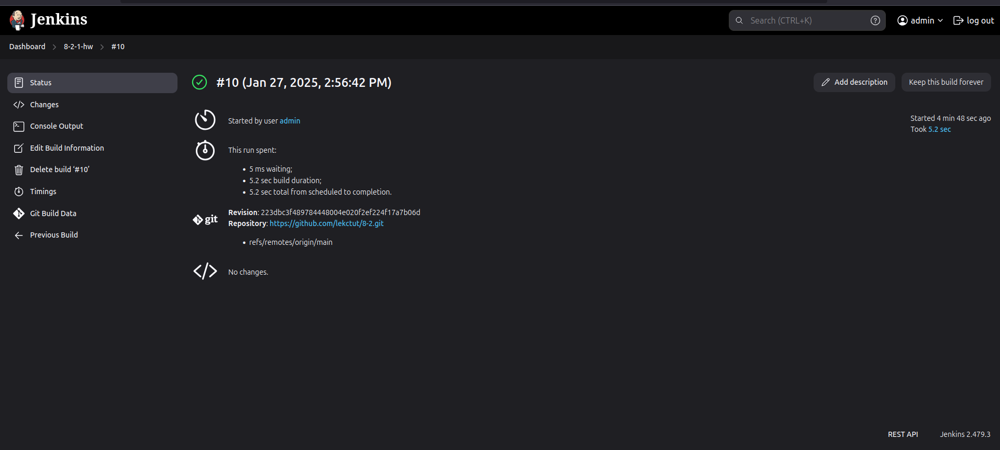

### Задание 2

Что нужно сделать:

1. Создайте новый проект pipeline.
2. Перепишите сборку из задания 1 на declarative в виде кода.

В качестве ответа пришлите скриншоты с настройками проекта и результатами выполнения сборки.

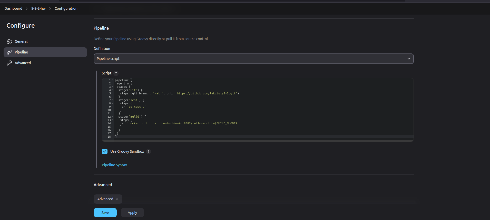
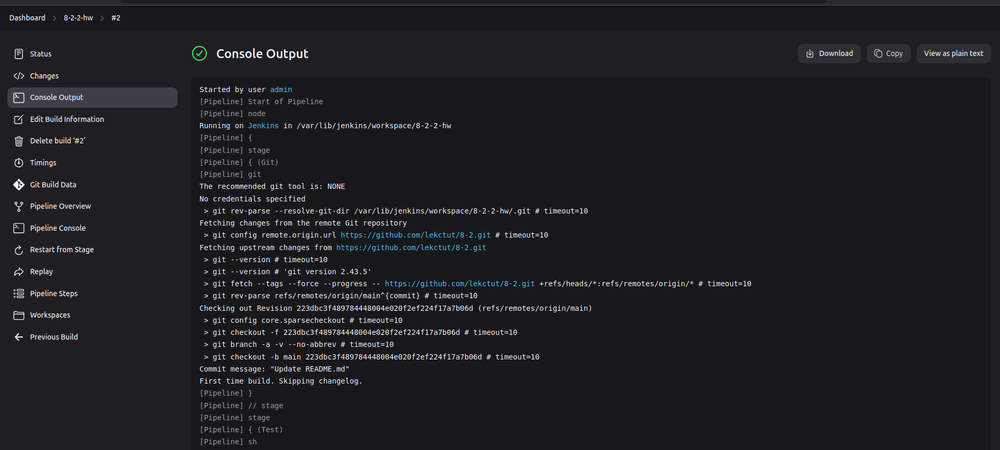
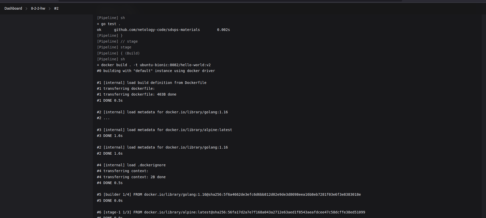
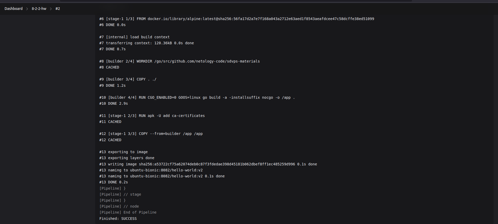

### Задание 3

Что нужно сделать:

1. Установите на машину Nexus.
2. Создайте raw-hosted репозиторий.
3. Измените pipeline так, чтобы вместо Docker-образа собирался бинарный go-файл. Команду можно скопировать из Dockerfile.
4. Загрузите файл в репозиторий с помощью jenkins.

В качестве ответа пришлите скриншоты с настройками проекта и результатами выполнения сборки.
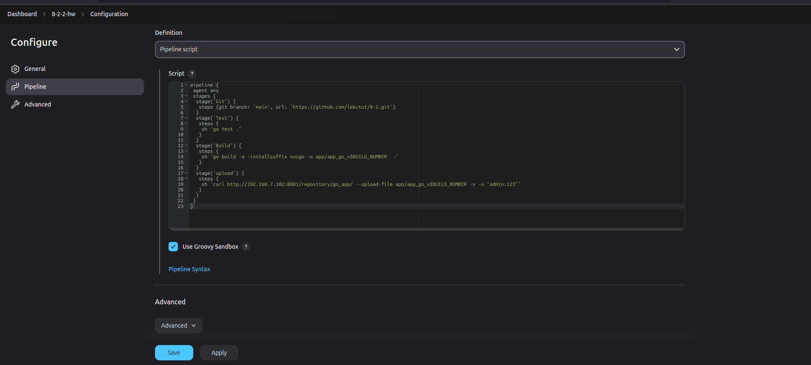
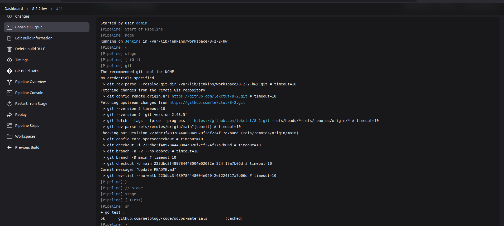
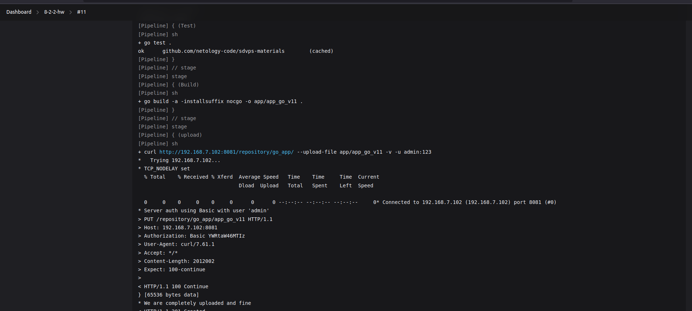
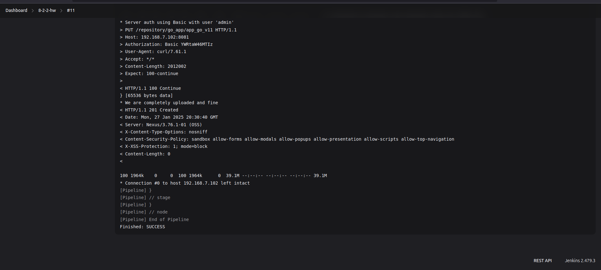
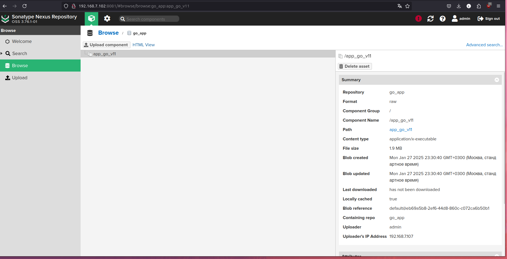